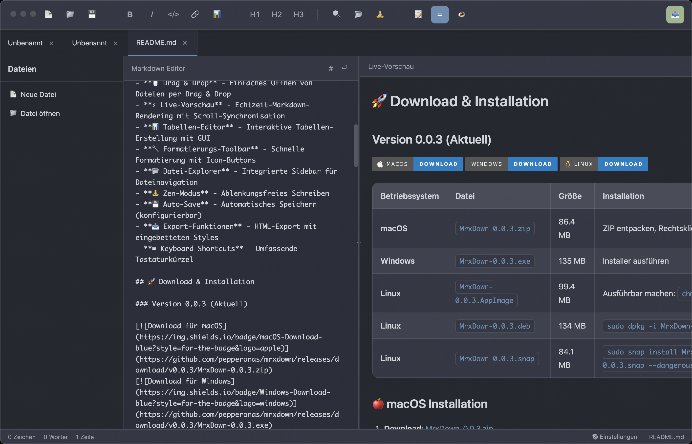

# MrxDown

<div align="center">
  

**Ein moderner Markdown-Editor mit Live-Vorschau**

[](https://github.com/pepperonas/mrxdown/releases)
[](https://github.com/pepperonas/mrxdown/releases)
[](LICENSE)
[](https://electronjs.org/)

  <br>

  
</div>

## ✨ Features

- **🌙 Modern Dark Theme** - Elegant Material Design-basierte Benutzeroberfläche
- **📑 Multi-Tab Support** - Arbeite mit mehreren Markdown-Dateien gleichzeitig
- **🖱️ Drag & Drop** - Einfaches Öffnen von Dateien per Drag & Drop
- **⚡ Live-Vorschau** - Echtzeit-Markdown-Rendering mit Scroll-Synchronisation
- **📊 Tabellen-Editor** - Interaktive Tabellen-Erstellung mit GUI
- **🔧 Formatierungs-Toolbar** - Schnelle Formatierung mit Icon-Buttons
- **📂 Datei-Explorer** - Integrierte Sidebar für Dateinavigation
- **🧘 Zen-Modus** - Ablenkungsfreies Schreiben
- **💾 Auto-Save** - Automatisches Speichern (konfigurierbar)
- **📤 Export-Funktionen** - HTML-Export mit eingebetteten Bildern & PDF-Export ohne Artefakte
- **🚀 Batch PDF Export** - Alle geöffneten Tabs auf einmal als PDF exportieren
- **🔍 Search & Replace** - Erweiterte Suchfunktion mit Regex-Unterstützung
- **👁️ File Watching** - Automatische Erkennung externer Dateiänderungen
- **⌨️ Keyboard Shortcuts** - Umfassende Tastaturkürzel

## 🚀 Download & Installation

### Version 0.3.0 (Aktuell)

[](https://github.com/pepperonas/mrxdown/releases/download/v0.3.0/MrxDown-0.3.0.zip)
[](https://github.com/pepperonas/mrxdown/releases/download/v0.3.0/MrxDown-0.3.0.exe)
[](https://github.com/pepperonas/mrxdown/releases/download/v0.3.0/MrxDown-0.3.0.AppImage)

| Betriebssystem | Datei                    | Größe   | Installation                                       |
|----------------|--------------------------|---------|----------------------------------------------------|
| **macOS**      | `MrxDown-0.3.0.zip`      | ~95 MB  | ZIP entpacken, Rechtsklick → "Öffnen"              |
| **Windows**    | `MrxDown-0.3.0.exe`      | ~135 MB | Installer ausführen                                |
| **Windows**    | `MrxDown-0.3.0.exe` (Portable) | ~125 MB | Direkt ausführbar, keine Installation            |
| **Linux**      | `MrxDown-0.3.0.AppImage` | ~99 MB  | Ausführbar machen: `chmod +x`                      |
| **Linux**      | `MrxDown-0.3.0.deb`      | ~134 MB | `sudo dpkg -i MrxDown-0.3.0.deb`                   |
| **Linux**      | `MrxDown-0.3.0.snap`     | ~84 MB  | `sudo snap install MrxDown-0.3.0.snap --dangerous` |

### 🍎 macOS Installation

1. **Download**: [MrxDown-0.3.0.zip](https://github.com/pepperonas/mrxdown/releases/download/v0.3.0/MrxDown-0.3.0.zip)
2. **Entpacken**: Doppelklick auf ZIP-Datei
3. **Öffnen**: Rechtsklick auf MrxDown.app → **"Öffnen"** → **"Öffnen"** bestätigen

> **💡 Tipp**: Nach dem ersten "Öffnen" funktioniert die App dauerhaft normal!

**🚀 Automatische Installation:**

```bash
curl -L https://raw.githubusercontent.com/pepperonas/mrxdown/main/install-macos.sh | bash
```

### 🪟 Windows Installation

1. **Download**: [MrxDown-0.3.0.exe](https://github.com/pepperonas/mrxdown/releases/download/v0.3.0/MrxDown-0.3.0.exe) (Installer) oder [MrxDown-0.3.0.exe](https://github.com/pepperonas/mrxdown/releases/download/v0.3.0/MrxDown-0.3.0.exe) (Portable)
2. **Installation**: Installer ausführen und Anweisungen folgen
3. **Start**: Desktop-Icon oder Startmenü

### 🐧 Linux Installation

#### AppImage (Universal)

```bash
# Download
wget https://github.com/pepperonas/mrxdown/releases/download/v0.3.0/MrxDown-0.3.0.AppImage

# Ausführbar machen
chmod +x MrxDown-0.3.0.AppImage

# Starten
./MrxDown-0.3.0.AppImage
```

#### DEB (Ubuntu/Debian)

```bash
# Download und Installation
wget https://github.com/pepperonas/mrxdown/releases/download/v0.3.0/MrxDown-0.3.0.deb
sudo dpkg -i MrxDown-0.3.0.deb

# Falls Abhängigkeiten fehlen:
sudo apt-get install -f
```

#### Snap

```bash
# Download und Installation
wget https://github.com/pepperonas/mrxdown/releases/download/v0.3.0/MrxDown-0.3.0.snap
sudo snap install MrxDown-0.3.0.snap --dangerous
```

## ⌨️ Keyboard Shortcuts

### Dateien

- `Cmd/Ctrl + N` - Neue Datei
- `Cmd/Ctrl + O` - Datei öffnen
- `Cmd/Ctrl + S` - Speichern
- `Cmd/Ctrl + Shift + S` - Speichern unter

### Formatierung

- `Cmd/Ctrl + B` - **Fett**
- `Cmd/Ctrl + I` - *Kursiv*
- `Cmd/Ctrl + K` - Link einfügen
- `Cmd/Ctrl + T` - Tabelle einfügen
- `Cmd/Ctrl + \`` - Code formatieren

### Überschriften

- `Cmd/Ctrl + 1-6` - Überschrift H1-H6

### Navigation

- `Cmd/Ctrl + F` - Suchen
- `Cmd/Ctrl + R` - Ersetzen
- `Cmd/Ctrl + \\` - Sidebar umschalten
- `Cmd/Ctrl + Shift + Z` - Zen-Modus
- `Cmd/Ctrl + Tab` - Zwischen Tabs wechseln

## 🏗️ Entwicklung

### Aus dem Quellcode starten

```bash
# Repository klonen
git clone https://github.com/pepperonas/mrxdown.git
cd mrxdown

# Abhängigkeiten installieren
npm install

# Anwendung starten
npm start

# Für alle Plattformen bauen
npm run build-all
```

### Technischer Stack

- **Electron 28.0.0** - Desktop-App-Framework
- **Marked.js** - Markdown-Parser
- **DOMPurify** - HTML-Sanitization
- **Material Design** - Design-System

### Beitrag leisten

1. Fork das Repository
2. Erstelle einen Feature-Branch (`git checkout -b feature/AmazingFeature`)
3. Committe deine Änderungen (`git commit -m 'Add some AmazingFeature'`)
4. Push zum Branch (`git push origin feature/AmazingFeature`)
5. Öffne einen Pull Request

## 📋 Changelog

### Version 0.3.0 (2025-01-07)

**🐛 Bugfixes:**
- **PDF-Export Bilddarstellung**: Entfernung des grauen Rands/Schattens um Bilder
  - Entfernung von `box-shadow: 0 2px 8px rgba(0,0,0,0.1)` aus PDF-Styling
  - Entfernung von `border-radius: 4px` für saubere Bildkanten
  - Fix gilt für einzelnen PDF-Export und Batch-PDF-Export
  - Bilder werden jetzt ohne visuelle Artefakte exportiert

**🎨 Verbesserungen:**
- **HTML-Export**: Optimierung der Bilddarstellung in HTML-Exporten
- **Konsistenz**: Einheitliche Bilddarstellung über alle Export-Formate

### Version 0.2.5 (2025-10-15)

**🔧 Optimierungen:**
- **PDF-Export vereinfacht**: Entfernung der Pandoc-Integration
  - Vollständige Entfernung aller Pandoc-Abhängigkeiten
  - Reduzierte Komplexität durch Fokus auf bewährten Chromium PDF-Export
  - Keine externen Tools mehr erforderlich
  - Verbesserte Emoji-Darstellung in PDF-Überschriften bereits in v0.2.4 gelöst
  - Batch-PDF-Export nutzt ausschließlich native Chromium-Engine
- **Schlankere Dependencies**: Entfernung von `node-pandoc` npm-Paket
- **Stabilität**: Verbesserte Zuverlässigkeit durch weniger externe Abhängigkeiten
- **Performance**: Schnellerer PDF-Export durch direkten Chromium-Rendering-Path

**🛠️ Technische Details:**
- PDF-Export verwendet ausschließlich Chromium's `printToPDF` API
- Emoji-Support durch native Systemfonts (Apple Color Emoji, Segoe UI Emoji, Noto Color Emoji)
- Markdown → HTML via marked.js, HTML → PDF via Chromium

### Version 0.2.4 (2025-10-14)

**🐛 Bugfixes:**
- **Emoji-Rendering in PDFs**: Korrektur der Emoji-Darstellung in PDF-Überschriften
  - Verwendung von `white-space: pre-wrap` für korrekte Emoji-Anzeige
  - Optimierte Font-Stack mit nativen Emoji-Fonts
  - 2 Sekunden Rendering-Delay für vollständige Emoji-Rasterung

### Version 0.2.0 (2025-09-03)

**🚀 Neue Features:**
- **🔍 Search & Replace**: Vollständige Suchfunktion mit Find/Replace Dialogen
  - Regex-Unterstützung für erweiterte Suchmuster
  - Case-sensitive und Whole-word Optionen für präzise Suche
  - Keyboard Shortcuts: Cmd+F (Suchen), Cmd+R (Ersetzen)
  - Highlighting gefundener Treffer im Editor
  - Replace-All Funktion für Massenersetzungen
- **👁️ File Watching**: Automatische Erkennung externer Dateiänderungen
  - Polling-basiertes System (alle 2 Sekunden) für zuverlässige Überwachung
  - Funktioniert mit allen Editoren (VS Code, Vim, TextEdit, Atom, etc.)
  - Intelligente Konflikterkennung bei ungespeicherten Änderungen
  - User-friendly Dialog zur Auswahl zwischen lokalen/externen Änderungen
  - Automatisches Reload bei Dateiberechtigungsänderungen
- **🚀 Batch PDF Export**: Raketen-Button (🚀) für PDF-Massenexport
  - Alle geöffneten Tabs mit einem Klick als PDF exportieren
  - Automatische Pfadgenerierung im gleichen Verzeichnis der Quelldateien
  - Visuelle Fortschrittsanzeige mit Tab-by-Tab Status
  - Umfassende Fehlerbehandlung und Benutzer-Feedback
  - Unterstützung für große Tab-Listen ohne Performance-Verlust

**🛠️ Verbesserungen:**
- **Multi-Platform Builds**: Vollständige Unterstützung für Windows (Installer + Portable), macOS (Universal Binary), Linux (AppImage, DEB, Snap)
- **Drag & Drop**: Verbesserte Dateipfad-Behandlung mit automatischem File Watching Setup
- **IPC-Kommunikation**: Robuste Renderer-Main-Process Kommunikation mit Error Recovery
- **Error Handling**: Umfassende Fehlerbehandlung bei allen File-Operations
- **Performance**: Optimierte Speicherverwaltung bei großen Dateien
- **UI/UX**: Responsive Design-Verbesserungen für verschiedene Bildschirmgrößen

**🔧 Technische Updates:**
- **Electron 28.0.0**: Neueste Electron-Version für bessere Sicherheit und Performance
- **Cross-Platform Testing**: Automatisierte CI/CD-Pipeline für alle Betriebssysteme
- **Code Signing**: Vorbereitung für macOS Notarisierung und Windows Code Signing

### Version 0.1.2 (2025-08-19)

**🛠️ Verbesserungen:**
- **Behebung schreibgeschützter Dateien**: Bessere Behandlung von read-only Dateien mit automatischer "Speichern unter..." Option
- **Verbesserte Fehlermeldungen**: Nutzerfreundlichere Dialoge bei Dateiberechtigungsproblemen
- **Stabilität**: Reduzierte EROFS-Fehler durch proaktive Berechtigungsprüfung
- **macOS Integration**: App wird als Standard-Editor für .md Dateien vorgeschlagen
- **Versionierung**: Neue semantische Versionsnummer (0.1.2 statt 0.0.11)

### Frühere Versionen

- **v0.0.10**: macOS Code Signing und Notarisierung
- **v0.0.9**: Automatisierte Multi-Platform Builds
- **v0.0.5**: Initiale stabile Version mit allen Kernfeatures

## 📋 Roadmap

### Version 1.0.0

- [x] PDF-Export
- [ ] Syntax-Highlighting im Editor
- [ ] Mermaid-Diagramm-Support
- [ ] Zusätzliche Themes

### Version 1.1.0

- [ ] Plugin-System
- [ ] Live-Collaboration
- [ ] Cloud-Sync
- [ ] Math-Formeln (KaTeX)

## 📞 Support

- **Issues**: [GitHub Issues](https://github.com/pepperonas/mrxdown/issues)
- **Diskussionen**: [GitHub Discussions](https://github.com/pepperonas/mrxdown/discussions)

## 📜 Lizenz

Dieses Projekt ist unter der MIT-Lizenz lizenziert - siehe die [LICENSE](LICENSE) Datei für Details.

## 👨‍💻 Entwickler

**Martin Pfeffer** © 2025

- GitHub: [@pepperonas](https://github.com/pepperonas)
- Website: [mrx3k1.de](https://mrx3k1.de)

---

<div align="center">
  <strong>Gemacht mit ❤️ in Deutschland</strong>
  <br>
  <em>Powered by Electron & Modern Web Technologies</em>
</div>