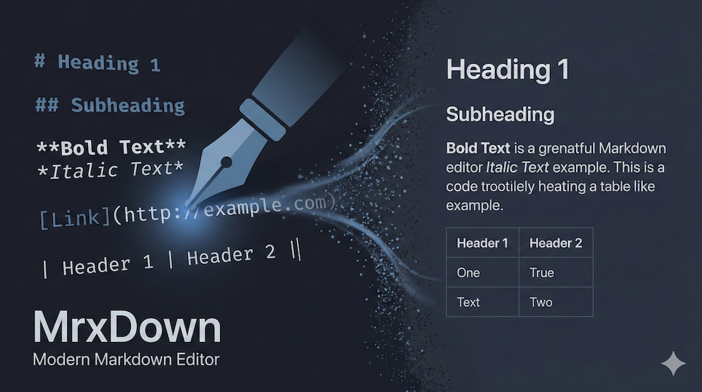
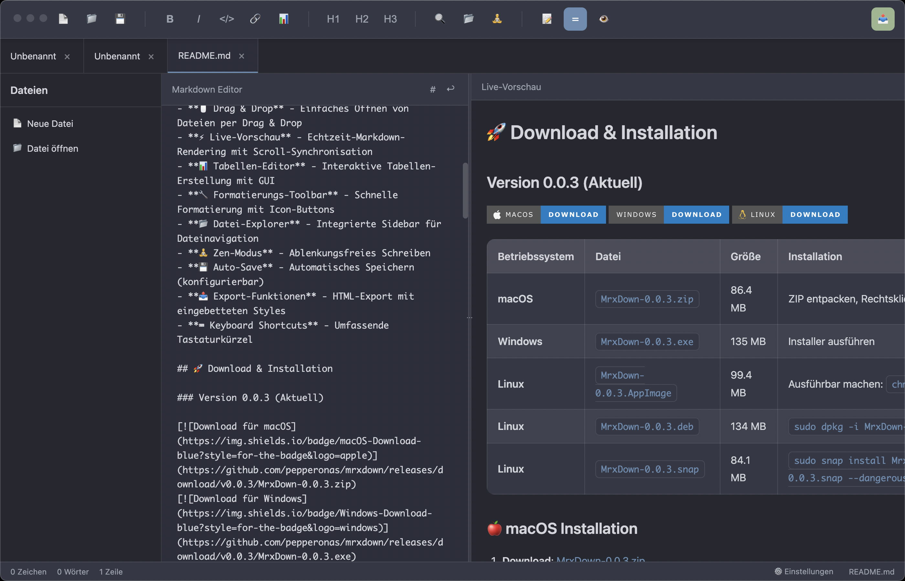

# MrxDown

<div align="center">
  

  <br><br>

[](https://github.com/pepperonas/mrxdown/actions/workflows/build.yml)
[](https://github.com/pepperonas/mrxdown/actions/workflows/build.yml)
[](https://github.com/pepperonas/mrxdown/releases)
[](https://github.com/pepperonas/mrxdown/releases)
[](LICENSE)
<br>
[](https://github.com/pepperonas/mrxdown/releases)
[](https://github.com/pepperonas/mrxdown/releases/latest)
[](https://github.com/pepperonas/mrxdown/releases/latest)
[](https://github.com/pepperonas/mrxdown/releases/latest)
<br>
[](https://electronjs.org/)
[](https://codemirror.net/)
[](https://marked.js.org/)
[](https://github.com/cure53/DOMPurify)
[](https://jestjs.io/)
<br>
[](https://github.com/pepperonas/mrxdown)
[](https://nodejs.org/)
[](https://github.com/pepperonas/mrxdown)
[](https://github.com/pepperonas/mrxdown)
<br>
[](https://github.com/pepperonas/mrxdown/stargazers)
[](https://github.com/pepperonas/mrxdown/network/members)
[](https://github.com/pepperonas/mrxdown/issues)
[](https://github.com/pepperonas/mrxdown/pulls)
[](https://github.com/pepperonas/mrxdown/commits/main)
[](https://github.com/pepperonas/mrxdown/graphs/contributors)
[](https://github.com/pepperonas/mrxdown/graphs/commit-activity)
[](https://github.com/pepperonas/mrxdown)

  <br>

  
</div>

## Features

| Kategorie | Feature |
|-----------|---------|
| **Editor** | Live-Vorschau mit Scroll-Sync, Syntax-Highlighting, Zeilennummern, Autocomplete |
| **Formatierung** | Toolbar mit Fett, Kursiv, Durchgestrichen, Code, Links, Tabellen, H1-H6 |
| **Themes** | Dark & Light Theme mit Toggle-Button |
| **Tabs** | Multi-Tab-Editor mit Drag-to-Reorder, Tab schließen / alle / andere |
| **Sidebar** | Datei-Explorer mit Ordnerstruktur + Dokument-Gliederung (Outline) |
| **Suche** | Nicht-modale Suche & Ersetzen mit Regex, Groß/Klein, Ganze Wörter |
| **Export** | HTML mit eingebetteten Bildern, PDF, Batch-PDF aller Tabs |
| **Schreiben** | Smart Enter (Listen), Auto-Save, Session Recovery |
| **Dateien** | Drag & Drop (Dateien + Ordner), File Watching, Recent Files, Einstellungen |
| **Editor-Ops** | Zeile duplizieren/löschen/verschieben, Block ein-/ausrücken, Kommentar-Toggle |
| **CLI** | Headless Markdown-zu-PDF Konvertierung vom Terminal |
| **Quick Action** | macOS Rechtsklick-Kontextmenü für Markdown → PDF Konvertierung |

## Download & Installation

### Aktuelle Version

[](https://github.com/pepperonas/mrxdown/releases/latest)
[](https://github.com/pepperonas/mrxdown/releases/latest)
[](https://github.com/pepperonas/mrxdown/releases/latest)

| Betriebssystem | Datei | Installation |
|----------------|-------|--------------|
| **macOS (Apple Silicon)** | `mrxdown-macos-arm64.zip` | Entpacken, Rechtsklick → "Öffnen" |
| **macOS (Intel)** | `mrxdown-macos-x64.zip` | Entpacken, Rechtsklick → "Öffnen" |
| **Windows** | `mrxdown-windows-x64.exe` | Installer ausführen |
| **Linux** | `mrxdown-linux-x86_64.AppImage` | `chmod +x` und starten |
| **Linux** | `mrxdown-linux-amd64.deb` | `sudo dpkg -i mrxdown-linux-amd64.deb` |

### macOS Hinweis

Da die App nicht mit einem Apple-Developer-Zertifikat signiert ist, zeigt macOS beim ersten Start eine Warnung. So funktioniert es:

1. ZIP entpacken
2. **Rechtsklick** auf `MrxDown.app` → **"Öffnen"**
3. Im Dialog **"Öffnen"** bestätigen

> **Tipp**: Nach dem ersten Öffnen funktioniert die App dauerhaft normal.

### CLI einrichten (optional)

```bash
sudo curl -L https://raw.githubusercontent.com/pepperonas/mrxdown/main/mrxdown-cli.sh -o /usr/local/bin/mrxdown
sudo chmod +x /usr/local/bin/mrxdown
```

```bash
mrxdown /path/to/datei.md       # Einzelne Datei → PDF
mrxdown /path/to/ordner/        # Alle .md Dateien im Ordner → PDF
```

### macOS Quick Action (optional)

Markdown-Dateien direkt im Finder per Rechtsklick in PDF konvertieren:

1. `MrxDown PDF.workflow` aus dem [Release](https://github.com/pepperonas/mrxdown/releases/latest) herunterladen
2. Doppelklick → in Automator "Installieren" wählen
3. Rechtsklick auf `.md`-Datei → **Schnellaktionen** → **MrxDown PDF**

> **Tipp**: Unter **Systemeinstellungen → Tastatur → Tastaturkurzbefehle → Dienste** kann ein eigener Shortcut zugewiesen werden (z.B. `Ctrl+Shift+P`).

## Keyboard Shortcuts

### Dateien

| Shortcut | Aktion |
|----------|--------|
| `Cmd/Ctrl + N` | Neue Datei |
| `Cmd/Ctrl + O` | Datei öffnen |
| `Cmd/Ctrl + S` | Speichern |
| `Cmd/Ctrl + Shift + S` | Speichern unter |
| `Cmd/Ctrl + E` | Als HTML exportieren |
| `Cmd/Ctrl + P` | Als PDF exportieren |

### Formatierung

| Shortcut | Aktion |
|----------|--------|
| `Cmd/Ctrl + B` | **Fett** |
| `Cmd/Ctrl + I` | *Kursiv* |
| `Cmd/Ctrl + Shift + X` | ~~Durchgestrichen~~ |
| `Cmd/Ctrl + K` | Link einfügen |
| `Cmd/Ctrl + T` | Tabelle einfügen |
| `` Cmd/Ctrl + ` `` | `Code` formatieren |
| `Cmd/Ctrl + 1-6` | Überschrift H1-H6 |

### Editor

| Shortcut | Aktion |
|----------|--------|
| `Cmd/Ctrl + D` | Zeile/Auswahl duplizieren |
| `Cmd/Ctrl + Shift + K` | Zeile löschen |
| `Cmd/Ctrl + L` | Zeile markieren |
| `Cmd/Ctrl + /` | Kommentar umschalten |
| `Alt + ↑/↓` | Zeile verschieben |
| `Tab` / `Shift + Tab` | Einrücken / Ausrücken |
| `Enter` | Smart Enter (Listen fortsetzen) |

### Navigation

| Shortcut | Aktion |
|----------|--------|
| `Cmd/Ctrl + F` | Suchen |
| `Cmd/Ctrl + R` | Ersetzen |
| `Cmd/Ctrl + \` | Sidebar umschalten |
| `Cmd/Ctrl + Tab` | Nächster Tab |
| `Cmd/Ctrl + Shift + Tab` | Vorheriger Tab |

## Entwicklung

```bash
git clone https://github.com/pepperonas/mrxdown.git
cd mrxdown
npm install
npm start          # App starten
npm test           # 65 Tests ausführen
```

### Lokal bauen

```bash
npm run build-mac        # macOS ZIP (x64 + arm64)
npm run build-win        # Windows NSIS Installer (x64)
npm run build-linux      # Linux AppImage + deb (x64)
npm run build-all        # Alle Plattformen
```

macOS-Builds werden lokal automatisch mit dem Developer-Zertifikat signiert (falls vorhanden). Für lokale Tests ohne Zertifikat:

```bash
npm run build-mac-local  # Baut + entfernt Quarantine-Attribute
```

### CI/CD & Releases

Builds und Releases laufen vollautomatisch über GitHub Actions:

| Workflow | Trigger | Beschreibung |
|----------|---------|-------------|
| **build.yml** | Push auf `main` | Tests + Builds für macOS, Windows, Linux |
| **release.yml** | Git-Tag `v*` | Builds + GitHub Release mit SHA256-Checksums |

**Neuen Release erstellen:**

```bash
# 1. Version in package.json hochzählen
# 2. Committen und pushen
git tag v0.X.Y && git push origin v0.X.Y
```

**Was passiert im CI:**

- **macOS**: Baut x64 + arm64 ZIPs, ad-hoc Code-Signing (damit macOS die App nicht als "damaged" blockiert)
- **Windows**: Baut NSIS Installer (x64)
- **Linux**: Baut AppImage + deb (x64), braucht `xvfb` für headless Build
- **Release**: Sammelt alle Artefakte, generiert SHA256-Checksums, erstellt GitHub Release

> **Hinweis**: macOS CI baut ZIP (kein DMG, da `hdiutil` auf GitHub Runnern fehlschlägt). Ubuntu 24.04 (Noble) hat `libgconf-2-4` entfernt — nicht als Dependency verwenden.

### Technischer Stack

- **Electron 28** — Desktop-App-Framework
- **CodeMirror 6** — Editor mit Syntax-Highlighting
- **Marked.js** — Markdown-Parser (lokal gebundelt)
- **DOMPurify** — HTML-Sanitization (lokal gebundelt)
- **Jest** — Testsuite mit 65 Tests

### Beitrag leisten

1. Fork das Repository
2. Feature-Branch erstellen (`git checkout -b feature/MeinFeature`)
3. Änderungen committen (`git commit -m 'Add MeinFeature'`)
4. Push (`git push origin feature/MeinFeature`)
5. Pull Request öffnen

## Changelog

### Version 0.6.5 (2026-03-06)

**Verbesserungen:**
- CLI: Chromium `service_worker_storage` Fehlermeldung beim headless PDF-Export unterdrückt
- macOS Quick Action: Markdown-Dateien direkt im Finder per Rechtsklick in PDF konvertieren (mit Benachrichtigung)
- Quick Action unterstützt Mehrfachauswahl und zeigt macOS-Notification bei Erfolg/Fehler

### Version 0.6.3 (2026-03-01)

**Bugfixes:**
- Windows: Dateien konnten nicht geöffnet/gespeichert werden (`fs.constants` war `undefined` weil `fs.promises` kein `constants` hat)
- Windows: Einstellungen, Recent Files und Session-Daten wurden nicht zuverlässig persistiert (fehlende `await` bei `fs.writeFile()`)
- Windows: Pfad-Erkennung bei Root-Pfaden wie `C:\` korrigiert (`lastSep >= 0` statt `> 0`)
- Fehlende Vendor-Libraries (`marked.min.js`, `purify.min.js`) im Repository ergänzt (waren durch `*.min.js` in `.gitignore` ausgeschlossen)
- DOMPurify als explizite Dependency in `package.json` aufgenommen

### Version 0.6.0 (2026-03-01)

**Bugfixes:**
- XSS-Schutz in Tab-Rendering (innerHTML → sichere DOM-Methoden)
- Externe Links öffnen korrekt im Standardbrowser via IPC
- Alle Einstellungen werden beim Start vollständig angewendet
- Getrennte Debounce-Timer für Suche und Ersetzen
- Dynamische Versionsanzeige im About-Dialog
- Debug-Logs aus Produktionscode entfernt
- Tote Funktionen entfernt

**Architektur:**
- PDF-CSS in gemeinsame Funktionen extrahiert (~750 Zeilen Duplikation entfernt)
- Marked.js und DOMPurify lokal gebundelt (keine CDN-Abhängigkeiten)
- Richtiger Einstellungs-Dialog statt prompt()-Aufrufe
- Nicht-modale, schwebende Such-/Ersetzen-Panels

**Neue Features:**
- Durchgestrichen-Button + `Cmd+Shift+X` Shortcut
- Warnung bei ungespeicherten Änderungen beim Beenden
- Dokument-Gliederung in der Sidebar (klickbare Headings)
- Tab Drag-to-Reorder
- Tab-Kontextmenü: Tab schließen / Andere schließen / Alle schließen
- Light/Dark Theme Toggle mit Persistenz
- Ankerlink-Navigation in der Vorschau (scrollt Editor + Preview)

**Tests:** 65 Tests (7 neue für Wrap/Unwrap-Logik)

### Version 0.5.0 (2026-02-23)

**Editor-Verbesserungen:**
- Undo/Redo repariert via `document.execCommand`
- Zeile duplizieren (`Cmd+D`), löschen (`Cmd+Shift+K`), verschieben (`Alt+↑/↓`)
- Zeile markieren (`Cmd+L`), Block ein-/ausrücken (`Tab`/`Shift+Tab`)
- Kommentar umschalten (`Cmd+/`), Smart Enter für Listen
- Jest-Testsuite mit 58 Tests, testbare Logik in `editor-utils.js` extrahiert

### Version 0.4.0 (2025-12-06)

- CLI Support: Headless Markdown-zu-PDF vom Terminal
- Batch-Modus für Ordner-Konvertierung
- PDF-Export Bugfixes (Zeilenabstände, `<br>` Tags)

### Version 0.3.0 (2025-01-07)

- PDF-Export Bilddarstellung ohne Artefakte
- HTML-Export Optimierung

### Version 0.2.0 (2025-09-03)

- Search & Replace mit Regex
- File Watching
- Batch PDF Export
- Multi-Platform Builds (macOS, Windows, Linux)

### Frühere Versionen

- **v0.1.2**: Schreibgeschützte Dateien, macOS Integration
- **v0.0.10**: macOS Code Signing und Notarisierung
- **v0.0.5**: Initiale stabile Version

## Roadmap

### Version 1.0.0

- [x] PDF-Export
- [x] Undo/Redo Support
- [x] Editor-Operationen (Zeile verschieben, duplizieren, löschen)
- [x] Smart Enter (Listen-Fortsetzung)
- [x] Automatisierte Tests
- [x] Light/Dark Theme
- [x] Syntax-Highlighting im Editor (CodeMirror 6)
- [ ] Mermaid-Diagramm-Support

### Version 1.1.0

- [ ] Plugin-System
- [ ] Live-Collaboration
- [ ] Cloud-Sync
- [ ] Math-Formeln (KaTeX)

## Support

- **Issues**: [GitHub Issues](https://github.com/pepperonas/mrxdown/issues)
- **Diskussionen**: [GitHub Discussions](https://github.com/pepperonas/mrxdown/discussions)

## Lizenz

MIT-Lizenz — siehe [LICENSE](LICENSE) für Details.

## Entwickler

**Martin Pfeffer** © 2025-2026

- GitHub: [@pepperonas](https://github.com/pepperonas)
- Website: [mrx3k1.de](https://mrx3k1.de)

---

<div align="center">
  <strong>Gemacht mit Leidenschaft in Deutschland</strong>
  <br>
  <em>Powered by Electron & Modern Web Technologies</em>
</div>
